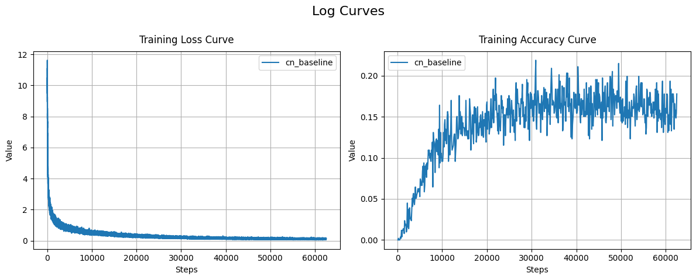

---
# 数据爬取
## 实验目的
1. 利用爬虫从网络分别爬取不少于中文和英文数据，不少于5M不多于10M。
2. 爬取结束后进行基本的处理
3. 抽取文本数据中的数字和日期
4. 统计并画出中文和英语单词的词频分布，验证齐夫定律
5. 分析不同主题下的词频差异
## 实验原理
### 数据来源
新华网不仅提供丰富的中文新闻报道，还设有专门的英文版网站。这使得用户能够同时获取高质量的中英文数据，满足实验中对两种语言数据的需求。此外，新华网网页结构稳定，方便通过爬虫工具提取数据，满足实验对数据量和多样性的要求。所以我们选择新华网作为数据来源。

访问`news.cn/robots.txt`来查看爬虫协议，确保实验的合法性：
```plaintext
# robots.txt for http://www.xinhuanet.com/
User-Agent: *
Allow: /
```
这说明任何人都是允许爬取的。

新华网提供了搜索服务，利用开发者工具查看网页活动发现，搜索是通过向一个网址发送GET请求实现的，网页会返回一个JSON文件，其中包含新闻的列表，含有每个新闻的标题、分区、链接、时间等。请求网址如下：
```python
SEARCH_PATTERN = 'https://so.news.cn/getNews?lang={lang}&curPage={page}\&searchFields={only_title}&sortField={by_relativity}&keyword={keyword}'
```

爬取思路大致是：先以初始关键词搜索获得新闻加入双端队列，然后依次访问队列中弹出的新闻进行爬取，再随机取访问的新闻标题中的一个词作为关键字，继续搜索加入队列。每次访问新闻后，将链接加入`visited`集合，避免重复访问。当`visited`的大小满足数据量需求时，终止搜索。初始关键字我们选取 `1`，这样搜索结果的倾向性较小。
### BeautifulSoup页面解析
`BeautifulSoup` 是一个用于解析HTML和XML的Python库，常用于从网页中提取所需的结构化数据。

由于标题、时间、分区等信息已经在搜索结果JSON中给出，我们只需要解析新闻的正文内容即可。利用开发者工具查看网页结构发现，正文的段落都在`id=detail`的`div`下的`<p></p>`中，用`BeautifulSoup`可以提取：
```python
def get_news(self, soup: BeautifulSoup, news: News) -> News:
	detail = soup.find('div', id='detail')
	paragraphs = detail.find_all('p')
	news.content = '\n'.join([p.text.strip() for p in paragraphs])
	...
```
### 基于requests的单线程爬虫
`requests` 是一个用于简化HTTP请求的Python库。它封装了Python自带的 `urllib` 模块，提供了更加人性化的接口，极大地简化了发送GET、POST等HTTP请求的代码书写。根据之前提到的爬取思路，定义`NewsCrawler`爬虫类：
```python
class NewsCrawler:
    """NewsCrawler类用于抓取新闻数据。
    Attrs:
        to_visit (Queue[News]): 待访问的新闻队列。
        data (list[News]): 已抓取的新闻数据列表。
        visited_urls (set[str]): 已访问的新闻URL集合。
        language (str): 抓取新闻的语言。
        max_news (int): 最大抓取新闻数量。
        init_keyword (str): 初始搜索关键词。
    Methods:
        crawl(self): 开始抓取新闻数据。
        search(self, keyword: str): 根据关键词搜索新闻。
        parse_search(self, response: requests.Response) -> list[str]|None: 解析搜索结果，返回新闻列表。
        is_news(soup: BeautifulSoup) -> bool: 判断页面内容是否为新闻。
        get_news(self, soup: BeautifulSoup, news: News) -> News: 从页面内容中提取新闻详细信息。
        save_data(self, foldername: str): 将抓取的数据保存到指定文件夹。
        load_data(self, foldername: str): 从指定文件夹加载已保存的数据。
    """
```
### 基于scrapy框架的并发爬虫
`Scrapy` 是一个功能强大的、用于网络爬虫开发的开源框架。它设计用于快速、高效地爬取和提取结构化数据，支持多线程和异步I/O操作，非常适合大规模数据采集任务。

首先在项目根目录下创建名为`news_crawler`的Scrapy爬虫项目
```bash
scrapy startproject news_crawler
```
生成一个爬虫模板在`spiders/news_spider`：
```bash
scrapy genspider example news.cn
```
按照上述爬取思路，修改模板：
```python
class NewsSpider(scrapy.Spider):
    """
    NewsSpider 是一个 Scrapy 爬虫类，用于从 news.cn 和 so.news.cn 网站上抓取新闻数据。
    属性:
        name (str): 爬虫名称。
        allowed_domains (list): 允许爬取的域名列表。
        visited_urls (set): 已访问的 URL 集合。
        news_queue (list): 新闻队列。
        ...
    方法:
        start_requests(self): 开始爬取请求，使用初始关键词。
        search(self, page, keyword): 根据关键词和页码生成搜索请求。
        parse_search(self, response): 解析搜索结果页面，提取新闻信息并加入队列。
        process_news_queue(self): 处理新闻队列中的新闻，生成新闻详情请求。
        is_news(soup): 静态方法，判断页面是否为新闻页面。
		...
    """
```
在`items.py`定义要爬取的数据结构`NewsItem`；然后在`pipeline.py`中定义数据处理流将爬取到的数据储存到JSON文件中。
### 正则表达式提取日期
正则表达式 (Regex) 是处理从页面中提取特定的信息任务的一种高效工具，它允许我们定义匹配模式，以识别文本中的特定结构。

日期有许多形式，例如`YYYY-MM-DD`, `MM月DD日`，`YYYY/MM`；并且分隔符也有许多形式；其中`MM`为1-12，`DD`为1-31。我们可以写出正则表达式：
```python
patterns = [
	r'\d{4}(?:年|-|/)(?:0?[1-9]|1[0-2])(?:月|-|/)(?:0?[1-9]|[12]\d|3[01])(?:日)?',  # 完整日期：YYYY-MM-DD
	r'\d{4}(?:年|-|/)(?:0?[1-9]|1[0-2])(?:月)?',                                    # 年月：YYYY-MM
	r'(?:0?[1-9]|1[0-2])(?:月|-|/)(?:0?[1-9]|[12]\d|3[01])(?:日)?'                  # 月日：MM-DD
]
```
然后利用`re.findall`进行匹配。
### Zipf定律
齐夫定律（Zipf's Law）是描述单词出现频率的一条经验法则，它指出在自然语言中，单词的频率与其频率排名之间的关系大致呈反比。即排名第k位的单词出现的频率大约是最常用单词频率的1/k。以`log(rank)`为横坐标，`log(frequency)`为纵坐标，绘制中英文词频的对数分布图。根据齐夫定律，这条曲线应该接近线性
## 实验流程
### 爬取数据
使用基于requests的爬虫进行数据爬取：
```python
from news_crawler.crawler_requests import NewsCrawler
crawler = NewsCrawler('en', 100)
crawler.crawl()
crawler.save_data('data/cn')
```
同样地，爬取英文数据。计算得，数据清洗前，平均一条中文新闻含有约500词，平均一条英文含有约250词。考虑到数据清洗带来的损耗，要分别获得5M词汇的中英文数据，需要爬取10,000条中文新闻与20,000条英文新闻。如果使用基于requests的单线程爬虫，将会花费很多时间，我们考虑使用scrapy并发爬虫框架。

使用基于requests的爬虫进行数据爬取，首先在`setting.py`配置参数，然后在命令行运行：
```bash
cd news_crawler
scrapy crawl news_spider -s CLOSESPIDER_ITEMCOUNT=10000 -s OUTPUT_DIR="../../data/cn" -a language="cn" -a start_keyword="1"
```
以爬取10,000条中文新闻，并储存在`data/cn`中。
```plaintext
2024-09-25 12:52:45 [scrapy.statscollectors] INFO: Dumping Scrapy stats:
{'downloader/request_bytes': 8349774,
...
 'elapsed_time_seconds': 267.455448,
...
2024-09-25 12:52:45 [scrapy.core.engine] INFO: Spider closed (closespider_itemcount)
```
利用并行爬虫，爬取10000条中文新闻只需要不到5分钟的时间。英文数据可同理爬取。
### 数据预处理
首先统一各个语言语料中的标点符号，去除不属于该语言的字符。然后利用jieba等进行分词，并删除单词数量小于某一阈值的句子。
### 提取日期
利用正则表达式提取中文数据中的日期，结果如下：
```plaintext
"6月21日",
"2023年7月23日",
"7月1日",
"7月4日",
"6月7日",
"1927年10月",
"2021年7月25日",
...
```
### 验证Zipf定律
绘制中英文`log(rank)-log(frequecy)`曲线：

发现这条曲线近似为一条斜率为-1的直线，说明Zipf定律是正确的。
### 词频差异分析
利用`wordcloud`包，以新华网的分区作为分类，去除常见的停用词，可以画出词云图。 

财经频道更加关注企业和市场发展。

而领导人报道集更关注战略方面的词汇，但都很关注中国的发展。

地方频道也有自己的特色关键词，比如山东的黄河，还有山东大学和一些本地企业。
## 实验总结
在本次实验中，我们成功通过网络爬虫从新华网爬取了不少于5M的中英文数据，完成了数据收集、预处理、数字和日期信息的抽取，验证了齐夫定律，并分析了不同主题下的词频差异。

首先，我们设计了基于`requests`和`scrapy`的爬虫框架，合理地选择新华网作为数据源，并利用其结构化的JSON接口快速爬取中英文新闻数据。在爬取过程中，我们通过多线程并发提高效率，成功在较短时间内获得了大规模的中英文新闻文本。

数据收集后，我们对文本进行了基本清洗和预处理，包括去除无关字符、标点符号处理及分词。在此基础上，我们使用正则表达式提取了文本中的日期信息，证明了正则表达式在处理结构化信息提取方面的高效性。

在词频统计和分析环节，通过绘制中英文新闻文本的`log(rank)-log(frequency)`曲线，验证了齐夫定律的正确性。曲线的斜率接近-1，表明在自然语言中，单词的频率与其排名之间确实呈现反比关系。

最后，我们对不同主题的文本进行了词频差异分析，使用词云图直观展示了不同分类下的高频词。通过比较财经频道、领导人报道、地方频道的词频分布，我们发现不同主题下的词汇使用有显著差异，各类文章都集中于其对应的内容主题，但同时也有一些共同的高频词反映了新闻报道的共同关注点，如中国的发展等。

实验充分验证了爬虫技术在大规模数据采集中的应用价值，并展示了齐夫定律在中英文新闻文本中的普遍性。通过分析词频差异，我们进一步揭示了不同主题下词汇使用的特点。

---
# 词向量
## 实验目的
1. 实现CBOW词向量方法
2. 分别在中文和英文上训练词向量
3. 给定20个单词，利用词向量找到与之最相似的10个单词
## 实验原理
### CBOW模型
CBOW（Continuous Bag of Words）模型是一种基于上下文预测词汇的词向量训练模型。其核心思想是：通过给定上下文词袋来预测中心词，通过大量的训练数据捕捉词汇之间的语义关系，从而生成高质量的词向量。

给定上下文词 $w_1, w_2, \dots, w_{2m}$（其中 $m$ 是窗口大小），上下文词的词向量 $v_{w_1}, v_{w_2}, \dots, v_{w_{2m}}$的平均值为：
   $$
   h = \frac{1}{2m} \sum_{i=1}^{2m} v_{w_i}
   $$
预测中心词 $w_c$ 的概率为：
$$
P(w_c | w_{context}) = \frac{\exp(v_{w_c} \cdot h)}{\sum_{i=1}^{V} \exp(v_i \cdot h)}
$$
其中，$V$是词汇表的大小，$v_{w_c}$ 是中心词的词向量，$v_i$ 是词汇表中其他词的词向量。

CBOW模型的目标是最大化给定上下文时正确预测中心词的概率，其损失函数为：
$$
L = -\sum_{w_c \in V} y_{w_c} \log(P(w_c | w_{context}))
$$
其中，$y_{w_c}$是真实的中心词的独热编码，$P(w_c | w_{context})$ 是模型预测的概率。

在使用负采样的情况下，损失函数变为：

$$L = -v_{w_c} \cdot h + \log\sum_{i=1}^{k}\exp(v_{w_i} \cdot h)$$
还有一种使用了LogSigmoid函数的变体：
$$L = -\log\sigma(v_{w_c} \cdot h) - \log\sigma\sum_{i=1}^{k}(-v_{w_i} \cdot h)$$

其中，$\sigma(x)$是 sigmoid 函数，$k$ 是负样本的数量，$w_i$ 是负样本的词，$v_{w_i}$ 是负样本的词向量。在之后我们会讨论这两种损失函数的差异。

我们使用`CBOW`类来进行词向量的嵌入与词向量的运算：
```python
class CBOW(nn.Module):
    """CBOW 类实现了连续词袋模型，用于词向量的训练和预测。
	参数:
		vocab_size (int): 词汇表的大小。
		emb_dim (int): 词向量的维度。
		shared_embeddings (bool, 可选): 是否共享输入和输出的词向量。默认为 False。
	方法:
        predict(self, bags: torch.Tensor) -> torch.Tensor: 预测给定词袋的类别标签。
        loss(self, pair, use_logsigmoid=True) -> torch.Tensor: 计算给定词袋、标签和负样本的损失。
        nearest(self, word_idx: int, k=10) -> list[int]: 基于余弦相似度找到给定词索引的最近邻词的索引。
```
可以用`shared_embeddings`指定是否共享嵌入权重；用`use_logsigmoid`指定loss是否使用logsigmoid函数。
### CBOW数据集
CBOW的每一组数据分为三个部分，中心词、上下文词袋和负样本。在词袋大小不变的情况下，三者分别为`(batch_size,)`、`(batch_size, 2*window_size)`、`(batch_size, neg_size)`的张量。我们使用`CBOWPairs`类来储存一个批次的三元组数据：
```python
class CBOWPairs:
    """CBOWPairs 类用于存储和处理连续词袋模型（CBOW）中的训练数据对。
    属性:
        bags (torch.Tensor): 转换为长整型的词袋张量。
        tags (torch.Tensor): 转换为长整型的标签张量。
        negatives (torch.Tensor): 转换为长整型的负采样词张量。
    """
```

数据集本身也存在一些细节问题。要保持词袋大小不变，我们对句子的末端进行延展，分别添加与窗口大小相等个数的特殊词汇`<START>`和`<END>`。对于低频词汇，我们都将其替换为特殊词汇`<UNK>`。数据集可以用`CBOWDataSet`类从分词好的txt文件中得到并储存：
```python
class CBOWDataSet:
    """
    CBOWDataSet类用于处理连续词袋（CBOW）模型的数据集。
    参数：
	    input_file (str): 输入文件路径。
        window_size (int): 窗口大小，词袋大小为2*window_size。
    属性:
        sentences (list[list[int]]): 句子列表，每个句子是单词索引的列表。
        coords (list[tuple[int]]): 所有有效坐标的列表，每个坐标是一个元组，包含句子索引和中心词在句子中的位置。
        vocab_size (int): 词汇表大小。
    方法:
        partition(batch_size: int, ratio: float=0.9, shuffle: bool=True, neg_size: int=5) -> tuple['CBOWDataLoader']: 将数据集划分为训练集和测试集。
    """
```
其中词汇表在建立数据集时被同时构建为`Vocabulary`类：
```python
class Vocabulary:
    """Vocabulary类用于构建和管理词汇表。
    属性:
        vocab (list[str]): 词汇表中的单词列表。
        word2idx (dict[str, int]): 从单词到索引的映射。
        freq (list[int]): 词汇表中每个单词的频率。
    方法:
        __getitem__(key: Any) -> Any: 根据键的类型检索项目。
        frequency(word: str) -> int: 返回词汇表中某个单词的频率。
    """
```
`Vocabulary`对象可以像列表一样用中括号索引，其`__getitem__` 方法是多态的：传入单词会返回其索引，传入整数会索引对应单词，传入列表则会对列表中每个元素进行上述操作。这个设计让索引-单词的相互转化十分方便。

训练时，通过`CBOWDataLoader`类像生成器一样依批次弹出`CBOWPairs`：
```python
class CBOWDataLoader:
    """
    CBOWDataLoader 类用于加载连续词袋（CBOW）模型的数据。
    参数:
        batch_size (int): 每个批次的大小。
        neg_size (int): 每个目标词的负采样数量。
    """
```
`CBOWDataLoader`类只储存数据三元组的坐标而不是完整的数据，只在需要时从`CBOWDataSet`中生成中心词和词袋，并即时采样负样本。这个设计可以节约储存的空间，更好地获取每个批次的训练数据。
### Word2Vec
`CBOW`类负责索引-向量转化与向量的运算，`Vocabulary`类负责单词-索引转化，将两个类集合起来形成`Word2Vec`类，即可实现单词到单词的预测，还可以集成词向量的训练：
```python
class Word2Vec:
    """Word2Vec 类用于训练和使用词向量模型。
    方法:
        __init__(model: CBOW, vocab: Vocabulary) -> None:
            初始化 Word2Vec 类。
        train(loader: CBOWDataLoader, epochs=10, lr=0.001, device='cuda', train_ratio=0.9, log_dir='./logs'):
            训练词向量模型。
        test(loader: CBOWDataLoader, device='cuda'):
            测试词向量模型。
        nearest(word: str) -> list[str]:
            查找与给定词最相近的词。
    """
```
其中训练时使用Adam优化器，训练中每 100 批次计算一次训练准确率，每轮计算一次验证准确率和loss，训练和验证的准确率都由Tensorboard记录在日志中。
## 实验流程
### 数据准备
用`CBOWDataSet`生成数据集，建立词汇表，并保存。由于语料词汇量大概在4M左右，属于较大的数据量了，我们选取窗口大小为5，并替换出现次数少于10的所有词汇为`<UKN>`。

使用`CBOWDataSet.partition()`以9:1的比例生成训练和测试用数据集，在训练开始之前就划分好可以防止测试数据泄露到训练数据集中。然后在每轮训练中将`CBOWDataLoader`以9:1的比例随机划分为测试集和验证集，用以验证超参的设定和模型的训练效果。
```plaintext
Processing data: 100%|██████████| 193071/193071 [00:02<00:00, 71485.18it/s] 
Traversing words: 100%|██████████| 6773154/6773154 [00:01<00:00, 3801855.16it/s]
Total unique words: 73019
Sorting words based on frequency...
Filtering words based on max_vocab...
Building word2idx mapping...
Building frequency list...
Converting sentences to indices: 100%|██████████| 193071/193071 [00:18<00:00, 10721.45it/s]
Generating coordinates: 100%|██████████| 193071/193071 [00:00<00:00, 353010.10it/s]
Shuffling coordinates...
Partitioning dataset...
Shuffling coordinates...
```
### 模型训练
汉语水平考试6级的词汇量约为5000，而英语6级的词汇量约为5500，所以选择对照组的词表大小为5000。以下参数作为对照组：
```python
dataset = CBOWDataSet(
	  'data/cn/tokenized.txt', 
	  window_size=5, 
	  max_vocab=5_000
)
train_loader, test_loader = dataset.partition(
    batch_size=512,
    neg_size=16,
    ratio=0.9,
)
word2vec.train(
	lr=1e-3,
	epoch=8,
	use_logsigmoid=True,
)
```
得到的loss曲线为：

loss曲线形状很正常，说明模型正常收敛。同理训练英文基线模型：

英文的准确率就会少一些，可能是由于英语是屈折语，在数据处理时，一个词的不同时态语态会被当做不同的单词，导致5000容量的词表有效单词容量较小，不能很好地反应语义信息。
#### 是否使用log-sigmoid作为loss的影响
尝试不使用log-sigmoid而直接使用原始loss，发现虽然早期可以收敛很快，但十分不稳定，loss迅速跌破0然后发散。这说明log-sigmoid增强了训练的稳定性。

#### 不同词表大小的影响
采用2500, 5000, 10000与20000的词表大小分别测试，发现loss都正常收敛，词表大小越大，预测准确率就越低。考虑到词表大小越小，即使是随机选取正确率也会升高，计算准确率相对于随机选取准确率的倍数发现，随着词表大小增长，这个倍数从600上升到1000。

#### 不同窗口大小的影响
采用1, 3, 5, 7的词表大小分别测试，发现loss都正常收敛，窗口大小越大，预测准确率越高。但从5到7的收益已经趋于平缓了，这说明窗口大小为5在这个数据量下可能是比较合适的。

#### 不同负采样大小的影响
采用4, 8, 16, 32的负采样大小进行训练。我们发现虽然前期训练速度会有差异，但到后期loss和准确率几乎一致。这说明至少在4-32这个范围内，负采样大小这个超参不太影响模型的训练效果。

### 近义词分析
利用`Word2Vec.nearest()`根据词向量的余弦相似度查找近义词得到：
```plaintext
Neighbors of 主席: ['担当', '正如', '研究员', '总理', '秘书长', '兰州', '论坛', '纪律', '院长', '部长']
Neighbors of 暴雨: ['强降雨', '山洪', '降雨', '受灾', '次生', '极端', '地质灾害', '突然', '中到大雨', '华南']
Neighbors of 党: ['同志', '开', '大学', '中国式', '意见', '党员', '面对', '若干', '建立健全', '百年']
Neighbors of 深化: ['深入', '取得', '交流', '巩固', '事业', '领域', '生产力', '提振', '贯彻落实', '十大']
Neighbors of 进口: ['董事长', '存量', '股份', '势头', '补充', '下降', '关税', '增长', '出口', '进出口']
Neighbors of 俄罗斯: ['希腊', '警察', '袭击', '联合声明', '匈牙利', '叙利亚', '东京', '中亚', '答案', '势力']
Neighbors of 一致: ['处罚', '遵守', '做出', '全人类', '关心', '议会', '民心', '法规', '会谈', '布']
Neighbors of 犯罪: ['违法行为', '予以', '案件', '违纪', '财产', '防范', '行为', '公告', '依法', '招聘']
Neighbors of 总量: ['品种', '比重', '景气', '合计', '回升', '收益', '年度', '大幅', '拉动', '年均']
Neighbors of 清华大学: ['编导', '希腊', '经典', '公安局', '国铁', '黑龙江省', '包银', '林剑', '图书馆', '科研机构']
Neighbors of 亚太: ['峰会', '首个', '态势', '贸易', '平稳', '联合声明', '外贸', '东南亚', '降雨', '出发']
Neighbors of 诞生: ['此', '高达', '延续', '伟业', '之中', '脚步', '秀', '码头', '奥运', '远方']
Neighbors of 文物: ['书法', '艺术', '馆', '阅读', '年轻人', '虚拟', '西湖', '量子', '舞蹈', '科普']
Neighbors of 中秋: ['端午', '经典', '南疆', '大楼', '前来', '假期', '季', '当时', '南京', '到来']
Neighbors of 月饼: ['古老', '大运河', '虹桥', '坐在', '晚上', '格外', '街', '图案', '夜晚', '造型']
Neighbors of 这次: ['有时', '大学', '历经', '主任', '布', '专家学者', '联合会', '境外', '伊朗', '国际奥委会']
Neighbors of 低空: ['业界', '空域', '衡阳', '之上', '航空器', '飞行器', '观光', '航空', '一家', '大连']
Neighbors of 谈: ['指明', '退费', '治国', '造福', '局势', '不好', '原材料', '防暑降温', '天下', '陷入']
Neighbors of 遭受: ['救治', '排涝', '热情', '高温', '中暑', '强降雨', '降低', '黄淮', '心中', '危害']
Neighbors of 务实: ['中塔', '非中', '中美', '试图', '典范', '约定', '方', '打压', '探讨', '原则']
```
可以看到，“主席”与其他领导职位词汇是相近的，“暴雨”与其他气象灾害是相近的，“深化”和其他相似的动词是相近的，这说明我们的词向量模型很好地学习了词汇的语义。
英文模型的结果如下：
```plaintext
Neighbors of president: ['peng', 'his', 'republican', 'zhao', 'ambassador', 'ceo', 'marcos', 'journalists', 'governor', 'commission']
Neighbors of great: ['victim', 'less', 'coffee', 'called', 'paths', 'becoming', 'and', 'once', 'broader', 'external']
Neighbors of storm: ['lifted', 'carrier', 'sen', 'rocket', 'injuries', 'demanding', 'risks', 'vienna', 'half', 'minutes']
Neighbors of deepen: ['comprehensively', 'consolidate', 'strengthen', 'accelerate', 'strive', 'actively', 'bilateral', 'southsouth', 'enhanced', 'beneficial']
Neighbors of import: ['52', 'museums', 'cicpe', 'asean', 'products', 'income', 'volume', 'shop', 'indicating', 'compared']
Neighbors of christmas: ['buddha', 'wait', 'ending', 'barcelona', 'embarked', 'manet', 'dc', 'club', '49', 'dropping']
Neighbors of panel: ['screen', 'acting', 'directorate', 'demonstrates', 'marcos', 'abuse', 'fired', 'petroleum', 'example', 'djokovic']
Neighbors of hometown: ['amazing', 'endeavors', 'machines', 'porcelain', 'sabalenka', 'juncao', 'childhood', 'begin', 'remote', 'truly']
Neighbors of inner: ['dosm', 'herders', 'minute', 'feb', 'casualties', 'transferred', 'diversion', 'strengthened', 'kehong', 'wellpreserved']
Neighbors of used: ['captured', 'vegetables', 'products', 'must', 'see', 'federal', 'montana', 'palestinian', 'introduced', 'coal']
Neighbors of japanese: ['increasing', 'fifa', 'several', 'kazakhstan', 'previous', 'characteristics', 'tai', 'sold', 'style', 'praised']
Neighbors of till: ['hall', 'dow', 'npc', 'winterlovers', 'swan', 'jan', 'effect', '14th', 'overlooked', 'right']
Neighbors of hailed: ['uae', 'robert', 'ample', 'presidents', 'hostilities', 'congo', '31st', 'charter', 'gateway', 'alleged']
Neighbors of navy: ['missiles', 'protests', 'swedens', 'imposed', 'bureau', 'missile', '14th', 'charter', 'passed', 'idf']
Neighbors of tonnes: ['cubic', 'tons', '8000', 'km', 'kilowatts', '107', 'hundreds', '96', 'biasionxinhua', 'euros']
Neighbors of sco: ['pragmatic', 'vowed', 'consultation', 'continue', 'drc', 'proficiency', 'reiterated', 'initiative', 'strengthen', 'heavily']
Neighbors of zhang: ['huang', 'painting', 'dong', 'wan', 'zheng', 'governor', 'film', 'xie', 'lin', 'peng']
Neighbors of tour: ['became', 'folk', 'selling', 'friday', 'sen', 'first', 'market', 'fireworks', 'cup', 'threeday']
Neighbors of key: ['daily', 'joint', 'primarily', 'integrated', 'producing', 'through', 'currently', 'integration', 'activity', 'can']
Neighbors of earthquakes: ['violent', 'courts', 'philippe', 'earthquake', 'skilled', '53', 'bigger', '07', 'forests', 'computer']
```
英文的效果就没有中文的好，但还是可以看出“zhang”姓氏和其他的姓氏是相近的，“president”也和其他职位相近，“deepen”和“strengthen”, “accelerate”等动词相近。
## 实验总结
在本实验中，我们成功实现了CBOW模型并在中文和英文语料上进行了词向量训练。通过对模型的超参数调整，如词汇表大小、窗口大小和负采样数量等，验证了这些因素对训练效果的影响。同时，我们通过近义词分析展示了模型能够准确识别与给定词汇相关的词，从而证明了CBOW方法在自然语言处理中的应用潜力。